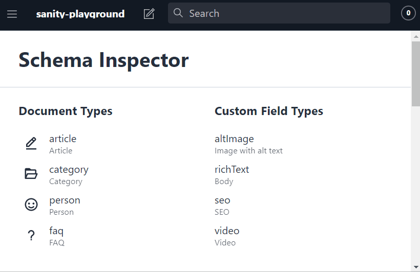

# sanity-plugin-schema-inspector

[Sanity](https://www.sanity.io/) tool plugin for inspecting your schemas. Make life easier for your frontend developers!

## Getting started

Install with [Sanity CLI](https://www.sanity.io/docs/cli):

`sanity install @andre-brdoch/sanity-plugin-schema-inspector`

A new `Schemas` tab should show in your tools bar. All custom types defined in `schema.js` will be inspectable.

## Features

- inspect custom schema types
- type definitions are linked
- download selected schema as JSON
- copy name by clicking `name` value
- routing

## Todos

- add config for controlling which [paths in the inspector are expanded](https://github.com/Lapple/react-json-inspector#propsisexpanded)
- add option for resolving the complete data model, instead of just linking to the other types

## Known Issues

- When navigating from other tools to the inspector, a reload is sometimes required
- certain fields like `icon` occupy a lot of space
